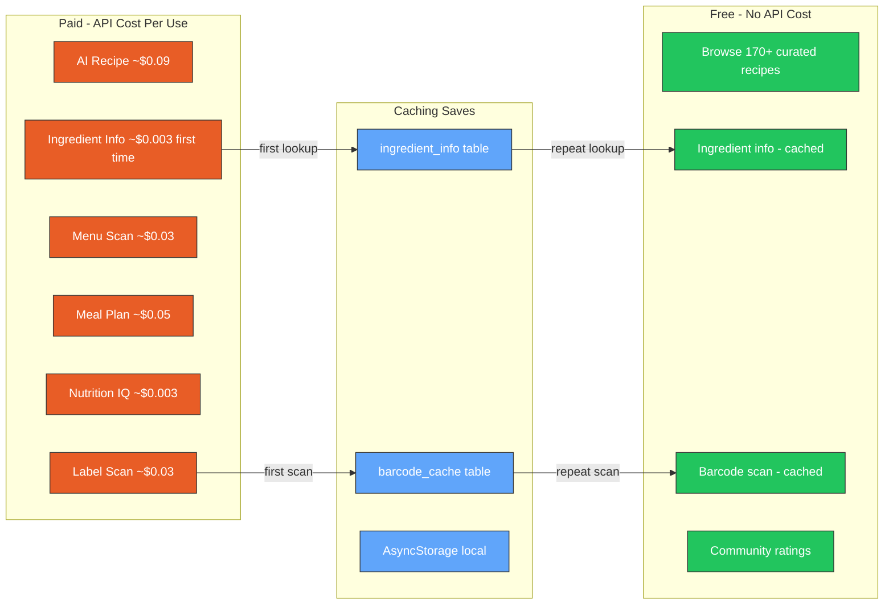
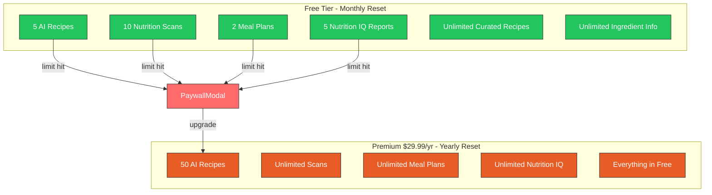

# SpiceStrong API Dependency Diagram

```mermaid
graph TB
    subgraph User Features
        SB[SpiceBuilder AI Recipe]
        NLS[Nutrition Label Scanner]
        RMS[Restaurant Menu Scanner]
        RIP[Recipe Import from Photo]
        MPG[Meal Plan Generator]
        NIQ[Nutrition IQ Reports]
        IED[Ingredient Education]
        FRS[Fridge/Receipt/List Scanner]
        CR[Community Ratings]
        FL[Freemium Limits]
    end

    subgraph External APIs
        CS[Claude Sonnet 4]
        CH[Claude Haiku 4.5]
        ED[Edamam Nutrition API]
        EDF[Edamam Food DB]
        OFF[Open Food Facts]
        FD[fal.ai Flux Dev]
        FS[fal.ai Flux Schnell]
    end

    subgraph Supabase
        RT[(recipes)]
        RI[(recipe_images)]
        RS[/recipe-images bucket/]
        RA[(ratings)]
        RV[(reviews)]
        MP[(meal_plan)]
        UDR[(user_dietary_restrictions)]
        II[(ingredient_info)]
        BC[(barcode_cache)]
    end

    subgraph Local Storage
        AS[AsyncStorage]
    end

    %% SpiceBuilder AI Recipe
    SB -->|generate recipe| CS
    SB -->|validate nutrition| ED
    SB -->|hero image| FD
    SB -->|step images| FS
    SB -->|save recipe| RT
    SB -->|save images| RI
    SB -->|upload images| RS

    %% Nutrition Label Scanner
    NLS -->|read label photo| CS
    NLS -->|barcode lookup| EDF
    NLS -->|barcode fallback| OFF
    NLS -->|AI summary| CS
    NLS -->|cache barcode| BC

    %% Restaurant Menu Scanner
    RMS -->|extract menu items| CS

    %% Recipe Import from Photo
    RIP -->|extract recipe| CS
    RIP -->|auto-fix protein| CS
    RIP -->|validate nutrition| ED
    RIP -->|generate images| FD
    RIP -->|generate images| FS
    RIP -->|save recipe| RT

    %% Meal Plan Generator
    MPG -->|generate plan| CS
    MPG -->|save plan| MP

    %% Nutrition IQ Reports
    NIQ -->|analyze pantry/list| CH

    %% Ingredient Education
    IED -->|check cache| II
    IED -->|generate info| CH
    IED -->|save cache| II

    %% Fridge/Receipt/List Scanner
    FRS -->|identify items| CH
    FRS -->|save items| AS

    %% Community Ratings
    CR -->|save rating| RA
    CR -->|save review| RV

    %% Freemium Limits
    FL -->|track usage| AS

    %% Styling
    classDef api fill:#E85D26,stroke:#333,color:#fff
    classDef db fill:#3ECF8E,stroke:#333,color:#fff
    classDef local fill:#60A5FA,stroke:#333,color:#fff
    classDef feature fill:#1A1A1A,stroke:#E85D26,color:#fff

    class CS,CH,ED,EDF,OFF,FD,FS api
    class RT,RI,RS,RA,RV,MP,UDR,II,BC db
    class AS local
    class SB,NLS,RMS,RIP,MPG,NIQ,IED,FRS,CR,FL feature
```

## Cost Flow Diagram

```mermaid
graph LR
    subgraph Free - No API Cost
        A1[Browse 170+ curated recipes]
        A2[Ingredient info - cached]
        A3[Barcode scan - cached]
        A4[Community ratings]
    end

    subgraph Paid - API Cost Per Use
        B1[AI Recipe ~$0.09]
        B2[Label Scan ~$0.03]
        B3[Menu Scan ~$0.03]
        B4[Meal Plan ~$0.05]
        B5[Nutrition IQ ~$0.003]
        B6[Ingredient Info ~$0.003 first time]
    end

    subgraph Caching Saves
        C1[barcode_cache table]
        C2[ingredient_info table]
        C3[AsyncStorage local]
    end

    B2 -->|first scan| C1
    C1 -->|repeat scan| A3
    B6 -->|first lookup| C2
    C2 -->|repeat lookup| A2

    classDef free fill:#22C55E,stroke:#333,color:#fff
    classDef paid fill:#E85D26,stroke:#333,color:#fff
    classDef cache fill:#60A5FA,stroke:#333,color:#fff

    class A1,A2,A3,A4 free
    class B1,B2,B3,B4,B5,B6 paid
    class C1,C2,C3 cache
```

## Freemium Limits

```mermaid
graph TD
    subgraph Free Tier - Monthly Reset
        F1[5 AI Recipes]
        F2[10 Nutrition Scans]
        F3[2 Meal Plans]
        F4[5 Nutrition IQ Reports]
        F5[Unlimited Curated Recipes]
        F6[Unlimited Ingredient Info]
    end

    subgraph Premium $29.99/yr - Yearly Reset
        P1[50 AI Recipes]
        P2[Unlimited Scans]
        P3[Unlimited Meal Plans]
        P4[Unlimited Nutrition IQ]
        P5[Everything in Free]
    end

    F1 -->|limit hit| PW[PaywallModal]
    F2 -->|limit hit| PW
    F3 -->|limit hit| PW
    F4 -->|limit hit| PW
    PW -->|upgrade| P1

    classDef free fill:#22C55E,stroke:#333,color:#fff
    classDef premium fill:#E85D26,stroke:#333,color:#fff
    classDef wall fill:#FF6B6B,stroke:#333,color:#fff

    class F1,F2,F3,F4,F5,F6 free
    class P1,P2,P3,P4,P5 premium
    class PW wall
```
